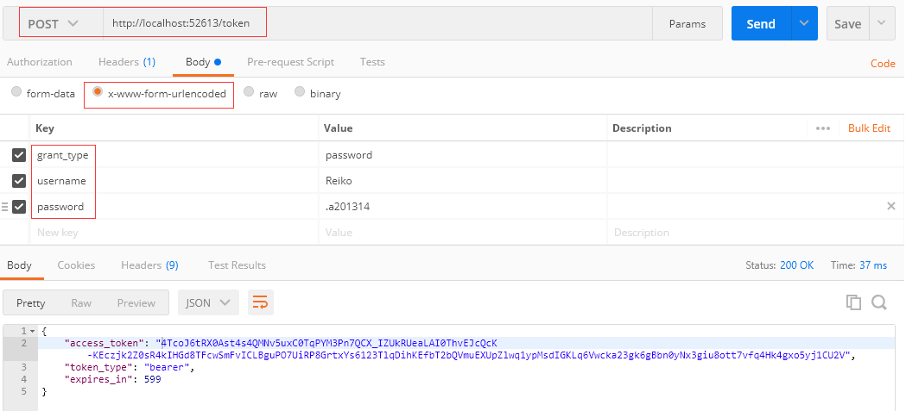
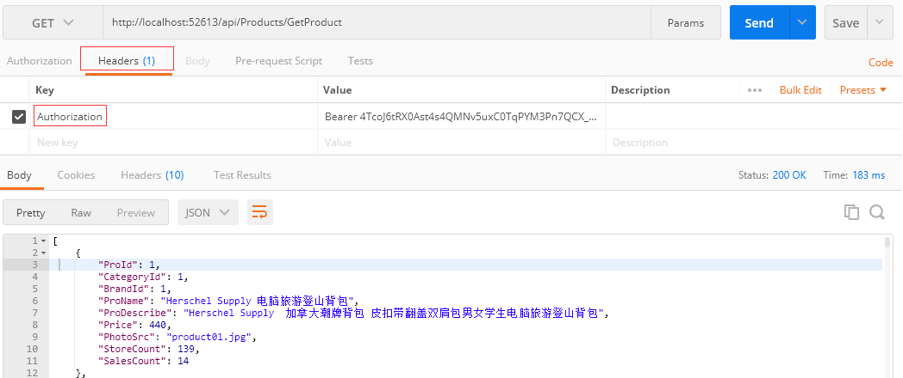

# WebapiIdentity

Asp.NET Web API2中用最简单的代码实现OAuth2.0认证授权，数据库使用SQLite+EF6

1. ### 所需添加的Nuget Packages

> - `Microsoft.Owin`
> - `Microsoft.Owin.Host.SystemWeb`
> - `Microsoft.Owin.Security.OAuth`
> - `Microsoft.AspNet.Identity.Owin`
> - `Microsoft.Owin.Cors `
> - `EntityFramework`
> - `System.Data.SQLite`
2. ### 获取Token
> 在Postman中获取token方法如下截图，在JavaScript中调用见项目根目录*Index.html* 
>
> 

3. ### 使用Token调用API
> 